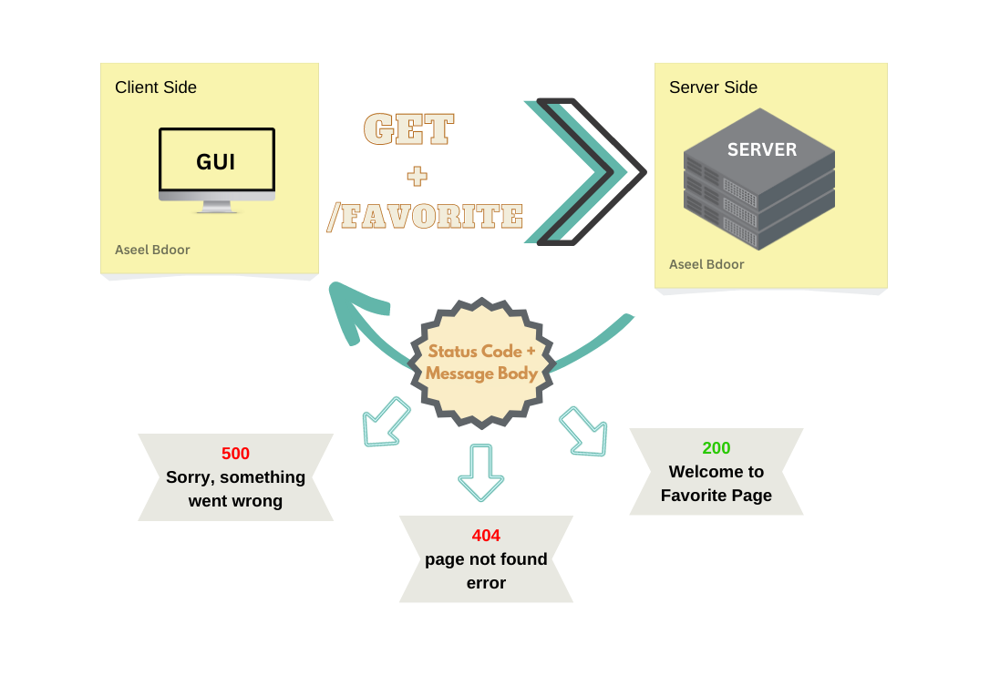

# Movies-Library - v18.14.0

**Author Name**: **`Aseel Bdoor`**

## WRRC

## Overview
This movie application will help you to check the latest movies based on categories
## Getting Started
<!-- What are the steps that a user must take in order to build this app on their own machine and get it running? -->
- put `npm init -y` in termenal
- create file `server.js` in vsCode
- put `npm install express` in termenal
- run the server using `node server.js`

## Project Features
<!-- What are the features included in you app -->
This application will handling all possible errors