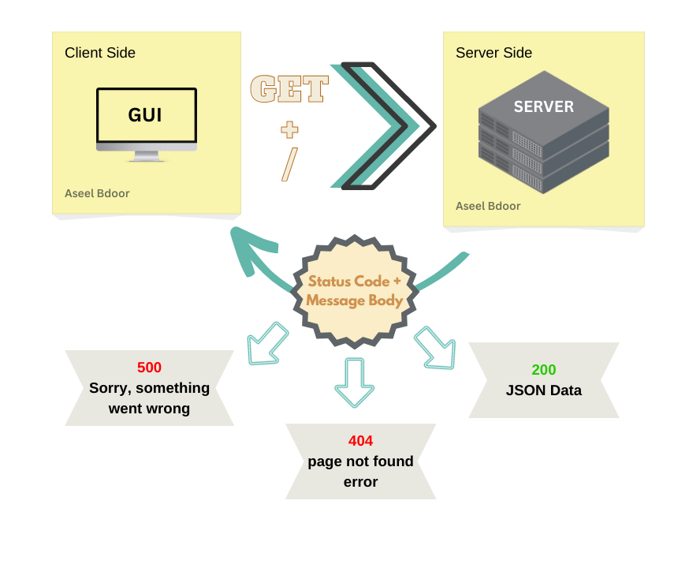

# Movies-Library - v18.14.0

**Author Name**: **`Aseel Bdoor`**

## WRRC

## Overview
- This movie application will help you to check the latest movies based on categories
- You can check about the trend movies 
- You can also searching abou the movie you want
- Of course, you can also search for the seasons you want from your movie by ID
- Finally, you can read all the reviews of other customers by ID as well
## Getting Started
<!-- What are the steps that a user must take in order to build this app on their own machine and get it running? -->
- put `npm init -y` in termenal
- create file `server.js` in vsCode
- put `npm i install` in termenal
- run the server using `nodemon`

## Project Features
<!-- What are the features included in you app -->
This app will handle all possible errors and give you the exact information you want